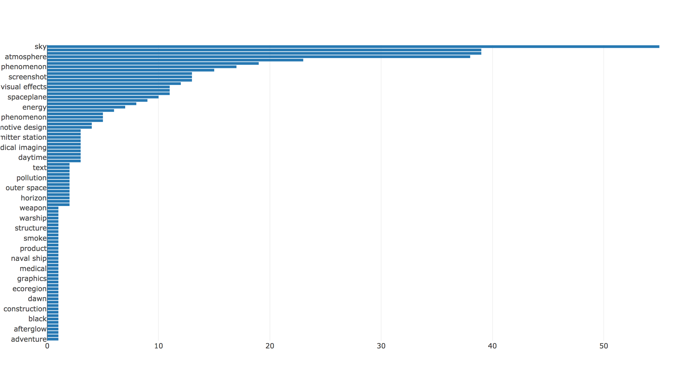

                               
# CLOUD-COMPUTING-CLASS-2018 – LAB06

 
* Sergio Ruiz: __sergiers@opendeusto.es__
* Dagoberto Herrera: __dagobertoherreramurillo@live.com__

---

## Task 6.3: Advanced Analytics as a Service in the Cloud (optional task)

### Before start...

After singing up and completing the [tutorial](https://github.com/CCBDA-UPC/Assignments-2018/blob/master/Lab06.md#task-63-advanced-analytics-as-a-service-in-the-cloud-optional-task) for getting the Json and everything we need to make requests to Google, we need to set the environment var, pointing to our Json key:
  
`GOOGLE_APPLICATION_CREDENTIALS`

or

`export GOOGLE_APPLICATION_CREDENTIALS="/path"`

### Part 1: getting the images from Twitter

We are going to use Twitter as our image source. For downloading the images, we are going to modify the [miguelmalvarez script](https://github.com/miguelmalvarez/downloadTwitterPictures). We just need to remove all the authentication part. We are also going yo use this file as a library, so we put some parameters in the `main()`. The result of this, is the `ImageDownloader.py` File.

Note we can use our `Access.py` class in order to use the PIN-based authentication, but we prefer to keep it simpler.   

### Part 2: Send the images to Google

For this task, we are going to use [google-cloud-vision-example](https://github.com/CCBDA-UPC/google-cloud-vision-example.git). We just remove the `print()` part for the result and we add `return service_request.execute()`. The result of this, is the `Label.py` File.

### Part 3: Create the plot
This is our `Main.py` File. This file is self-explanatory because is full of comments explaining the code. We are using the `plotly` library to represent our results. This library will generate a HTML file, containing the graph, resulting in a much better way to represent the data than `matplotlib`. Take a look also to the [html result](plot.html)

Here are some results:

SpaceX:

Our Professor:

NY times:

__Q63__: What problems have you found developing this section? How did you solve them? The principal problem was to obtain images from some source. Because Instagram does not allow this anymore, we had to use twitter as the source. Even the third parties API for instagram does not work.

__Q64__: How long have you been working on this session (including the optional part)? What have been the main difficulties you have faced and how have you solved them? The amount of time, more or less, just for the optional part was about 4 hours. Compared with previous labs, this does not have so much problems. One thing that made our live much easier was to change the library for the plots. This new one is more easy to use and more powerful. 
